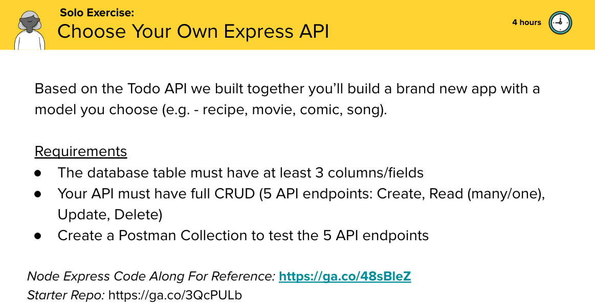

# Pru Individual In Class App

This repo is used for you to work on your personal app after we work on each section of the Todo App together in class.

## To get started

1. In your VM, open your Terminal and change into your Documents folder: `cd ~/Documents`.

1. Fork and clone down your fork of this repo using the SSH URL option: `git clone git@git.generalassemb.ly:<THIS_SHOULD_BE_YOUR_USERNAME>/pru-individual-in-class-app
.git`.

   - [You can find Fork and Clone instructions here](https://git.generalassemb.ly/ModernEngineering/getting-started-cohort-4-october-2023#fork-and-clone-lessonslabs)

1. `cd` into the `pru-individual-in-class-app` folder. Inside it, create a new folder: `mkdir backend`.

## To submit your work each day

[How to commit and push your work to GitHub](https://git.generalassemb.ly/ModernEngineering/getting-started-cohort-4-october-2023#to-commit-and-push-your-work-to-github)

## Submit a Pull Request

[Submit a Pull Reqest](https://git.generalassemb.ly/ModernEngineering/getting-started-cohort-4-october-2023#submitting-your-work-via-pull-request)
